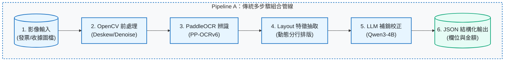
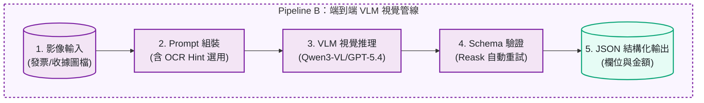
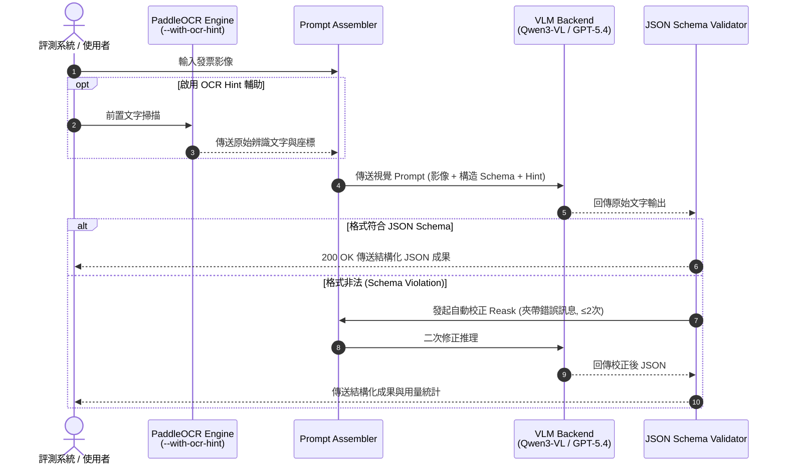

# receipt-ocr-vlm-benchmark

[](https://github.com/kuotunyu/receipt-ocr-vlm-benchmark/actions/workflows/ci.yml)


[](https://github.com/kuotunyu/receipt-ocr-vlm-benchmark/releases/tag/v1.0.0)
[](LICENSE)

本專案提供繁體中文發票與收據結構化欄位擷取之全方位基準測試 (Benchmark Suite)：針對傳統多步驟組合管線 (OpenCV ➔ PaddleOCR ➔ Layout Split ➔ LLM Refine) 與端到端視覺語言模型管線 (VLM + OCR Hint + Schema Validator) 在欄位精確度 (Exact Match)、推理延遲、權重資源與 API 成本進行實測與量化對比。

---

## 系統設計與關鍵特性

1. **雙管線架構評測 (Pipeline A vs B)**：
   對比「傳統多步驟套件組合管線」與「端到端 VLM 視覺管線」，評估非標準格式下的泛化能力。
2. **OCR Hint 前置文字引導**：
   在 VLM Prompt 中引入輕量 OCR 文字座標作為提示，顯著提升微小字體與印章覆蓋字元之欄位擷取精確度。
3. **自動 Reask 與 JSON Schema 驗證**：
   內建 Pydantic / Output Parser 驗證器，當 VLM 輸出違背 Schema 格式時自動觸發二次修正 Reask 機制。
4. **多維度量化報告與重現腳本**：
   自動計算總金額 (`total_amount`)、日期 (`date`)、賣方統一編號 (`seller_tax_id`) 等欄位之 Exact Match，並自動匯出 CSV/JSON 報告。

---

## 系統架構與 pipeline

### 1. Pipeline A：傳統多步驟 OCR 組合管線



### 2. Pipeline B：端到端 VLM 視覺語言管線



### 3. OCR Hint 輔助與 Reask 錯誤重試時序 (Sequence Diagram)



---

## 評測矩陣與綜合結果

數據採合成繁中發票 (45 張) 與 SROIE 真實收據 (45 張) 測試集。

| 管線機制 | 合成繁中 Avg Exact | SROIE Avg Exact | p50 Latency (Warm) | 單位成本 (每百張) | 選型特性說明 |
|---|---:|---:|---:|---:|---|
| **Qwen3-VL-8B (地端 VLM)** | **0.971** | 0.829 | 23.3s / 55.2s | GPU 時間換算 | 高準確度且隱私安全，適合有地端 GPU 之生產環境 |
| **Qwen3-VL-8B + OCR Hint** | **0.981** | 0.803 | 26.5s / 52.7s | GPU 時間換算 | 複雜背景干擾與弱格式收據表現最佳 |
| **GPT-5.4-nano** | 0.660 | **0.857** | **1.8s / 3.6s** | **$0.04 / $0.10** | 超低延遲與極低 API 成本，但純 Prompt 在繁中表頭易受干擾 |
| **GPT-5.4-nano + OCR Hint** | 0.908 | **0.857** | **2.0s / 3.6s** | **$0.04 / $0.11** | API 方案首選，結合 OCR Hint 大幅降低繁中錯誤率 |

- **Exact Match 標準**：總金額、發票號碼與賣方統編必須 100% 完全相同。
- 完整詳細對比數據見 [docs/eval.md](docs/eval.md)。

---

## 快速開始

需求：Python 3.11+、`uv`、可用 GPU (地端 Qwen3-VL) 或 OpenAI API Key (GPT-5.4)。

### 1. 環境設定與套件安裝

```powershell
uv sync
copy .env.example .env
```

### 2. 執行評測基準測試

```powershell
# 執行 Pipeline A (傳統 OCR 組合) 評測
uv run python run_eval.py --pipeline traditional --dataset synthetic_zh

# 執行 Pipeline B (VLM + OCR Hint) 評測
uv run python run_eval.py --pipeline vlm --model qwen3-vl-8b --with-ocr-hint

# 執行單元測試
uv run pytest -q tests
```

---

## 專案結構

| 檔案 / 目錄 | 功能說明與職責 |
|---|---|
| `run_eval.py` | 基準評測執行主程式入口 |
| `src/pipelines/traditional.py` | 傳統多步驟組合管線 (OpenCV + PaddleOCR + Qwen) |
| `src/pipelines/vlm.py` | 端到端 VLM 視覺管線 (Qwen3-VL / GPT-5.4) |
| `src/evaluator.py` | Exact Match 評測與導出統計矩陣 |
| `data/` | 測試發票與收據標註資料集 |
| `reports/` | 評測數據 JSON/CSV 輸出 |

---

## 授權與聲明

本專案採 [MIT License](LICENSE)。標註資料集僅供學術研究與評測使用。
