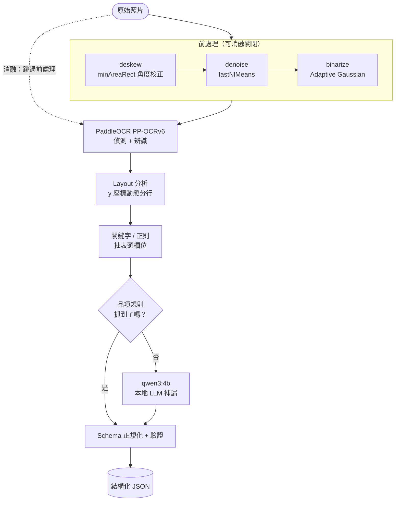
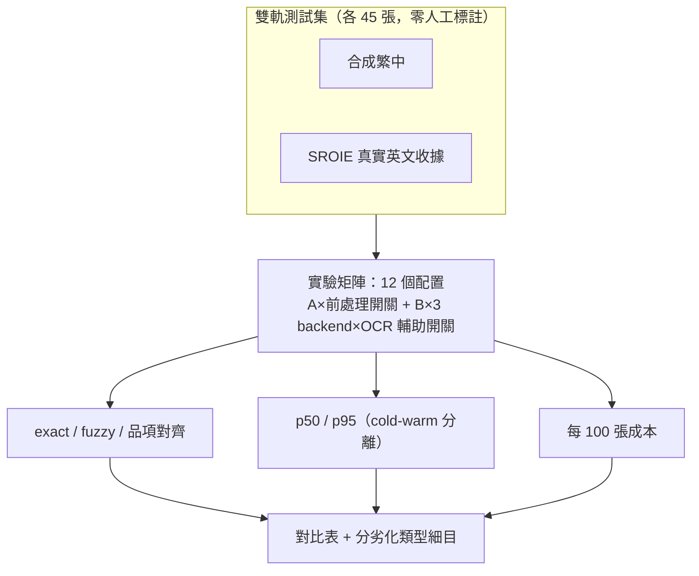

# 繁體中文文件理解：傳統 OCR 管線 vs 端到端 VLM

> 對台灣發票/收據做關鍵欄位抽取（結構化 JSON 輸出），以準確率、延遲、成本三維度，
> 對比「OpenCV 前處理 + PaddleOCR + 規則/LLM 組裝」與「端到端 VLM」兩條管線，
> 並用消融實驗回答「什麼場景該用哪條管線」。

> 資料策略：因故未拍照+人工標註真實台灣發票，改採**雙軌零標註方案**——45 張合成繁體中文
> 發票/收據 + 45 張 **SROIE**（ICDAR 2019 真實英文收據基準）。詳見 [EVAL_REPORT.md](EVAL_REPORT.md)
> 的「資料策略」說明與 [plan.md](plan.md) 的完整 pivot 記錄。

> 授權範圍：根目錄的 MIT License 僅適用於本專案原創程式碼；SROIE 資料與衍生範例圖片沿用
> 上游條款。來源、授權標示、修改內容與論文引用見 [THIRD_PARTY_NOTICES.md](THIRD_PARTY_NOTICES.md)。

## 結果摘要

**核心發現：可移植性崩跌**——Pipeline A 從合成繁中的 0.92~0.97 掉到 SROIE 真實英文收據只剩
0.39~0.42；VLM 只從 0.97~0.98 掉到 0.80~0.86。同一套規則換一個語言/國家的收據就大幅崩潰，
VLM 用同一個 prompt 幾乎原封不動還能用七、八成。

| 管線 | 合成繁中 45 avg exact | SROIE 45 avg exact | p50 延遲（warm，合成/SROIE） | 每 100 張成本 |
|---|---|---|---|---|
| Pipeline A－有前處理 | 0.917 | **0.390** | 19.7s / 19.9s | 近似免費 |
| Pipeline A－無前處理 | 0.965 | **0.416** | 5.6s / 19.3s | 近似免費 |
| Qwen3-VL-8B（本地） | 0.971 | 0.829 | 23.3s / 55.2s | GPU 時間換算 |
| Qwen3-VL-8B + OCR 輔助 | 0.981 | 0.803 | 26.5s / 52.7s | GPU 時間換算 |
| GPT-5.4-nano | 0.660 | 0.857 | 1.8s / 3.6s | $0.04 / $0.10 |
| GPT-5.4-nano + OCR 輔助 | 0.908 | 0.857 | 2.0s / 3.6s | $0.04 / $0.11 |

表中正式數字可直接在 [`results/official/`](results/official/README.md) 查核；公開 artifact 僅含
聚合指標與來源摘要雜湊，不包含逐張 OCR 文字、圖片、執行期錯誤或本機路徑。

其他發現（完整分析見 [EVAL_REPORT.md](EVAL_REPORT.md)）：前處理效果依劣化類型而定，二值化在模糊圖上
讓 Pipeline A 近乎全滅（1.00→0.14）但在旋轉圖上是決定性的（0.76→1.00）；OCR 輔助文字對不同 VLM
效果不一致；items F1 會掩蓋名稱層級的錯字，需搭配 `items_name_exact_rate` 檢查。

## 架構

### Pipeline A：傳統 OCR 管線



### Pipeline B：端到端 VLM


### 評估框架



## 資料範例

<table>
<tr>
<td align="center"><br>合成繁中・清晰基準</td>
<td align="center"><br>合成繁中・旋轉</td>
<td align="center"><br>合成繁中・印章遮擋</td>
<td align="center"><br>合成繁中・熱感紙褪色</td>
<td align="center"><br>SROIE 真實收據（已遮罩）</td>
<td align="center"><br>SROIE 真實收據（已遮罩）</td>
</tr>
</table>

合成繁中圖片為程式生成的虛構內容，無真實個資；上方兩張 SROIE 範例來自真實照片，已遮罩個人
層級資訊（電話、員工代碼），保留店名/GST ID 等商家層級公開資訊（後者正是「Pipeline A 誤把
GST ID 當統編」發現的示範素材）。詳見 [docs/examples/README.md](docs/examples/README.md) 的遮罩政策說明。

## Quickstart

```powershell
# 環境
python -m venv .venv
.venv\Scripts\python -m pip install -r requirements.txt
.venv\Scripts\python -m pytest

# .env（Pipeline B 的 API backend 需要）
copy .env.example .env
# 編輯 .env 填入 GOOGLE_API_KEY / OPENAI_API_KEY

# 產生/下載雙軌資料集（各 45 張，零人工標註）
.venv\Scripts\python scripts\make_synthetic_dataset.py
.venv\Scripts\python scripts\download_sroie.py

# 跑評估框架
.venv\Scripts\python scripts\run_eval.py --images-dir data/synthetic/raw --labels-dir data/synthetic/labels --backends ollama,openai
.venv\Scripts\python scripts\run_eval.py --images-dir data/sroie/raw --labels-dir data/sroie/labels --ocr-lang en --no-items --backends ollama,openai
.venv\Scripts\python scripts\make_report.py results/eval_<timestamp>/summary.json
.venv\Scripts\python scripts\challenge_breakdown.py results/eval_<timestamp>/raw.json data/synthetic/manifest.json

# 不呼叫模型或網路：確認公開 summary 與本機正式結果一致
.venv\Scripts\python scripts\export_official_results.py --check

# 單張圖快速試跑（示範/除錯用，不需要 ground truth）
.venv\Scripts\python scripts\run_pipeline.py --pipeline a --image data/synthetic/raw/syn_001.jpg
.venv\Scripts\python scripts\run_pipeline.py --pipeline b --image data/synthetic/raw/syn_001.jpg --backend qwen3-vl

# 標註工具仍保留（若之後想補真實照片，把照片放進 data/raw/）
.venv\Scripts\python -m uvicorn annotator.main:app --port 8010
```

只要查核不會呼叫模型或 API 的單元測試時，可改安裝 `requirements-test.txt`；GitHub Actions
也使用這組輕量依賴，不會在 CI 下載 PaddleOCR 權重或執行任何模型。

本地 Pipeline B backend 需要 [Ollama](https://ollama.com) 並 `ollama pull qwen3-vl:8b`（約 6GB）；
Pipeline A 的 OCR 引擎（PaddleOCR）與品項補漏 LLM（`ollama pull qwen3:4b`）皆在本機 CPU/GPU 執行。

`run_eval.py` 支援 `--only <config>`（如 `a_pre`/`ollama`/`ollama_hint`/`openai_hint`）只跑單一配置、
執行完立刻合併落盤——長時間評估可拆成多個獨立行程跑，中途任何一個掛掉也不會丟失已完成的部分
（正式雙軌評估中，本地 VLM 曾在處理大張真實照片時讓 Ollama 服務崩潰，靠這個設計加上重跑救回來）。

## 文件索引

- [plan.md](plan.md) — 開發計畫、各 Phase 進度與實測發現（含所有踩過的坑）
- [DESIGN.md](DESIGN.md) — 前處理/模型選型理由、結構化輸出穩定性處理
- [EVAL_REPORT.md](EVAL_REPORT.md) — 完整對比表、錯誤類型分析、場景結論
- [docs/DATA_COLLECTION_GUIDE.md](docs/DATA_COLLECTION_GUIDE.md) — 拍攝指引與 diversity matrix
- [results/official/README.md](results/official/README.md) — 去識別化正式評估摘要與重建方式
- [THIRD_PARTY_NOTICES.md](THIRD_PARTY_NOTICES.md) — SROIE 來源、授權標示、修改與引用

## 目前狀態

- [x] Phase 0：schema 凍結、正規化規則 + 單元測試
- [x] Phase 1：標註工具（含 OCR 預填）+ 拍攝指引（保留備用，未實際採用真人拍照）
- [x] Phase 2：Pipeline A（前處理 + PaddleOCR + layout + 規則/LLM 組裝）
- [x] Phase 3：Pipeline B（本地 qwen3-vl:8b / Gemini 3.5 Flash / gpt-5.4-nano 三個 backend 皆驗證）
- [x] Phase 4：評估框架 + 雙軌 45×2 張正式評估（合成繁中 + SROIE 真實英文收據）已完成
- [x] Phase 5：全部公開文件（本頁、DESIGN、EVAL_REPORT）已用正式雙軌結果撰寫完成
