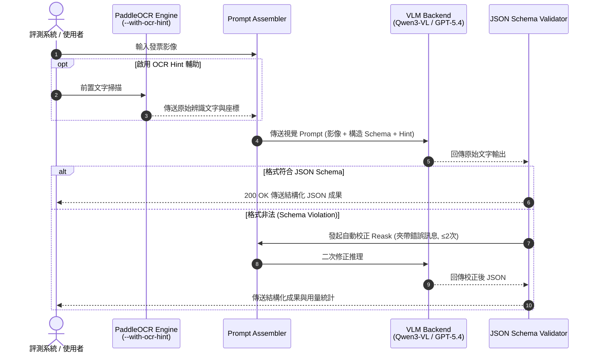

# receipt-ocr-vlm-benchmark

[](https://github.com/kuotunyu/receipt-ocr-vlm-benchmark/actions/workflows/tests.yml)


[](LICENSE)

本專案為繁體中文文件理解 (Document AI) 評測框架，對台灣發票與收據關鍵欄位抽取 (結構化 JSON 輸出) 進行橫向對比：
* **Pipeline A (傳統多步驟組合管線)**：OpenCV 前處理 + PaddleOCR PP-OCRv6 + 規則與正則特徵抽取 + 本地 LLM 補銷。
* **Pipeline B (端到端 VLM 視覺語言管線)**：端到端 VLM (地端 Qwen3-VL-8B / API GPT-5.4-nano) + 可選 OCR Hint 輔助。

評測維度涵蓋準確度 (Exact Match / Fuzzy F1)、延遲 (p50/p95 Latency) 與單位成本 (Cost per 100 images)，並包含消融實驗 (Ablation Study) 與複雜文件 (Complex Document) 評測分頁。

---

## 關鍵發現

1. **傳統規則管線之可移植性崩跌 (Portability Collapse)**：
   Pipeline A 在格式固定的合成繁中發票表現優異 (0.917 至 0.965 Exact Match)，但切換至真實英文收據 (SROIE) 時驟降至 0.390 至 0.416 (固定正則與座標規則失效)。相較之下，端到端 VLM (Qwen3-VL-8B / GPT-5.4-nano) 展現極高跨語言與跨版面泛化能力 (0.971 保持至 0.800 至 0.857)。

2. **圖像前處理的雙面刃效應**：
   二值化 (Adaptive Binarization) 在模糊影像上會破壞字元邊緣導致 OCR 全滅 (1.00 降至 0.14 Exact Match)；但在角度傾斜 (Rotate) 影像上，傾斜校正 (Deskew) 為關鍵決定因素 (0.76 提升至 1.00)。

3. **OCR Hint 與 VLM 的協同對比**：
   在真實繁中收據上，引入 OCR 辨識文字作為 VLM Prompt 之 Hint 輔助，可將 Exact Match 從 0.714 提升至 0.914，並修正因背景干擾引發之無效 JSON 格式；代價為額外執行 CPU PaddleOCR，使端到端 Warm p50 延遲增加約 4.7 倍。

---

## 系統架構與推論管線

### 1. 雙軌並排架構對比 (Pipeline A vs Pipeline B)

```mermaid
%%{init: {'themeVariables': {'fontSize': '20px'}}}%%
flowchart TD
    subgraph TrackA ["Pipeline A：傳統多步驟 OCR 組合管線"]
        direction LR
        A1["發票影像"] --> A2["OpenCV 前處理<br/>(Deskew / Denoise)"] --> A3["PaddleOCR PP-OCRv6<br/>(文字偵測與辨識)"] --> A4["Layout 分析<br/>(座標動態分行)"] --> A5["正則特徵抽取"] --> A6["Qwen3-4B LLM 補銷"] --> A7[("結構化 JSON 輸出")]
    end

    subgraph TrackB ["Pipeline B：端到端 VLM 視覺語言管線"]
        direction LR
        B1["發票影像"] --> B2["Prompt 組裝<br/>(含 OCR Hint 選用)"] --> B3["端到端 VLM 推理<br/>(Qwen3-VL-8B / GPT-5.4)"] --> B4["JSON Schema 驗證 & Reask 重試"] --> B5[("結構化 JSON 輸出")]
    end

    style A6 fill:#e7f5ff,stroke:#1971c2,stroke-width:2px
    style B4 fill:#fff9db,stroke:#f59f00,stroke-width:2px
```



### 2. OCR Hint 輔助與 Reask 錯誤重試時序 (Sequence Diagram)



---

## 評測矩陣與綜合結果

數據採合成繁中發票 (45 張) 與 SROIE 真實收據 (45 張) 測試集。

| 管線機制 | 合成繁中 Avg Exact | SROIE Avg Exact | p50 Latency (Warm) | 單位成本 (每百張) | 選型特性說明 |
|---|---:|---:|---:|---:|---|
| **Qwen3-VL-8B (地端 VLM)** | **0.971** | 0.829 | 23.3s / 55.2s | GPU 時間換算 | 高準確度且隱私安全，適合有地端 GPU 之生產環境 |
| **Qwen3-VL-8B + OCR Hint** | **0.981** | 0.803 | 26.5s / 52.7s | GPU 時間換算 | 複雜背景干擾與弱格式收據表現最佳 |
| **GPT-5.4-nano** | 0.660 | **0.857** | **1.8s / 3.6s** | **$0.04 / $0.10** | 超低延遲與極低 API 成本，但純 Prompt 在繁中表頭易受干擾 |
| **GPT-5.4-nano + OCR Hint** | 0.908 | **0.857** | **2.0s / 3.6s** | **$0.04 / $0.11** | API 方案首選，結合 OCR Hint 大幅降低繁中錯誤率 |
| **Pipeline A (有前處理)** | 0.917 | 0.390 | 19.7s / 19.9s | 近似免費 (CPU) | 適用於格式極度固定之單一發票樣式 |
| **Pipeline A (無前處理)** | 0.965 | 0.416 | **5.6s / 19.3s** | 近似免費 (CPU) | 無 GPU 資源且無旋轉/模糊之輕量場景 |

詳細消融實驗、失敗案例與 5 張真實繁中收據 Add-on 評測見 [EVAL_REPORT.md](EVAL_REPORT.md)。

---

## 複雜文件研究軌 (Complex-Document Track)

除了發票欄位抽取外，本專案另延伸包含了針對長篇繁中官方文件 (如年報、公文) 的 Layout Parsing、Table Routing 與 Chunking 檢索傳播效應研究：
- **數據集**：包含 5 份繁中公開文件、26 個精選難頁、37 個人工 Hard Cases。
- **結論摘要**：Table-region Router 與 Qwen Parser 能提高答案與引用準確率，但跨層級檢索 (MRR) 與結構化 Caption 尚未過 Promotion Gate。
- 詳細架構、消融數據與 Gate 判定條件見 [docs/COMPLEX_DOCUMENT_BENCHMARK.md](docs/COMPLEX_DOCUMENT_BENCHMARK.md)。

---

## 快速開始

### 1. 環境設定與套件安裝

```powershell
python -m venv .venv
.venv\Scripts\python -m pip install -r requirements.txt
.venv\Scripts\python -m pytest -q
```

### 2. 下載測試數據集 (合成繁中 45 張 + SROIE 45 張)

```powershell
.venv\Scripts\python scripts\make_synthetic_dataset.py
.venv\Scripts\python scripts\download_sroie.py
```

### 3. 執行評測與單張測試

```powershell
# 執行評測 (Ollama 地端 + OpenAI API)
.venv\Scripts\python scripts\run_eval.py --images-dir data/synthetic/raw --labels-dir data/synthetic/labels --backends ollama,openai

# 單張影像管道 A / 管道 B 試跑
.venv\Scripts\python scripts\run_pipeline.py --pipeline a --image data/synthetic/raw/syn_001.jpg
.venv\Scripts\python scripts\run_pipeline.py --pipeline b --image data/synthetic/raw/syn_001.jpg --backend qwen3-vl
```

---

## 授權與聲明

本專案之程式碼採 [MIT License](LICENSE)。數據集包含 SROIE 數據集與合成繁中發票樣本。
