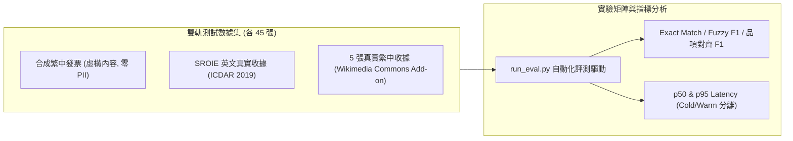

# receipt-ocr-vlm-benchmark

[](https://github.com/kuotunyu/receipt-ocr-vlm-benchmark/actions/workflows/ci.yml)


[](LICENSE)

本專案對繁體中文發票與收據之關鍵欄位抽取（結構化 JSON 輸出）進行橫向評測。以準確率 (Exact Match / Fuzzy F1)、延遲 (p50/p95 Latency) 與單位成本 (Cost per 100 images) 三個維度，對比「Pipeline A（傳統黑盒 OCR + OpenCV 前處理 + 規則/LLM 補銷）」與「Pipeline B（端到端 VLM + OCR Hint）」兩條技術管線，並透過消融實驗 (Ablation Study) 建立不同場景之選型準則。

## 核心發現

1. **傳統規則管線之可移植性崩跌 (Portability Collapse)**：Pipeline A 在合成繁體中文發票達成 0.917~0.965 之高 Exact Match，但切換至真實英文收據 (SROIE) 時降至 0.390~0.416（固定正則與座標規則失效）。相對地，端到端 VLM (Qwen3-VL-8B / GPT-5.4-nano) 跨語言表現保持高穩定度 (0.971 -> 0.829~0.857)。
2. **圖像前處理為雙面刃**：二值化 (Adaptive Binarization) 在模糊影像上會破壞字元邊緣導致 OCR 全滅 (1.00 -> 0.14 Exact Match)；但在角度傾斜 (Rotate) 影像上，傾斜校正 (Deskew) 為關鍵決定因素 (0.76 -> 1.00)。
3. **OCR Hint 與 VLM 的協同與開銷 Trade-off**：在真實繁中收據上，引入 OCR 辨識文字作為 VLM Prompt 之 Hint 輔助，可將 Exact Match 從 0.714 提升至 0.914，並修正因背景干擾引發之無效格式；但代價為增加 CPU PaddleOCR 推理時間，端到端 p50 延遲為純 VLM 的 4.7 倍。

## 系統管線架構

```mermaid
flowchart TD
    subgraph Pipeline_A ["Pipeline A · 傳統 OCR 組合管線"]
        IMG1["原始收據影像"] --> PREP["前處理 (Deskew / Denoise / Binarize)"]
        PREP --> OCR["PaddleOCR PP-OCRv6 (偵測與辨識)"]
        OCR --> LAYOUT["Layout 分析與動態分行"]
        LAYOUT --> RULES["正則與關鍵字特徵抽取"]
        RULES --> CHECK{"欄位完整？"}
        CHECK -->|否| LLM["Qwen3-4B 本地 LLM 補銷"]
        CHECK -->|是| NORmA["Schema 正規化與校驗"]
        LLM --> NORmA
    end

    subgraph Pipeline_B ["Pipeline B · 端到端 VLM 管線"]
        IMG2["原始收據影像"] --> VPROMPT["Prompt 組裝 (Schema 導引 + 影像)"]
        HINT["PaddleOCR 辨識文字 (--with-ocr-hint)"] -.-> VPROMPT
        VPROMPT --> BACKEND{"VLM Backend"}
        BACKEND -->|地端| QWEN["Qwen3-VL-8B (Ollama)"]
        BACKEND -->|API| GPT["GPT-5.4-nano"]
        QWEN & GPT --> PARSE["JSON 解析與 Schema 驗證"]
        PARSE --> VALID{"格式合法？"}
        VALID -->|否, ≤2次| RETRY["攜帶錯誤訊息發起 Reask"]
        RETRY --> VPROMPT
        VALID -->|是| NORmB["Schema 正規化與用量統計"]
    end
```



## 評測矩陣與綜合結果

數據採合成繁中發票 (45 張) 與 SROIE 真實收據 (45 張) 之測試集。

| 管線機制 | 合成繁中 Avg Exact | SROIE Avg Exact | p50 Latency (Warm) | 單位成本 (每百張) | 系統特性與選型建議 |
|---|---:|---:|---:|---:|---|
| **Qwen3-VL-8B (地端 VLM)** | **0.971** | 0.829 | 23.3s / 55.2s | GPU 時間換算 | 高準確度且隱私安全，適合有地端 GPU 的生產環境 |
| **Qwen3-VL-8B + OCR Hint** | **0.981** | 0.803 | 26.5s / 52.7s | GPU 時間換算 | 複雜干擾與弱格式收據表現最佳 |
| **GPT-5.4-nano** | 0.660 | **0.857** | **1.8s / 3.6s** | **$0.04 / $0.10** | 超低延遲與極低 API 成本，但純 Prompt 在繁中表頭易受干擾 |
| **GPT-5.4-nano + OCR Hint** | 0.908 | **0.857** | **2.0s / 3.6s** | **$0.04 / $0.11** | API 方案首選，結合 OCR Hint 大幅降低繁中錯誤率 |
| **Pipeline A (有前處理)** | 0.917 | 0.390 | 19.7s / 19.9s | 近似免費 (CPU) | 格式極度固定之單一國家/發票樣式 |
| **Pipeline A (無前處理)** | 0.965 | 0.416 | **5.6s / 19.3s** | 近似免費 (CPU) | 無 GPU 資源且無複雜旋轉/模糊之輕量場景 |

*註：詳細的消融實驗數據、失敗案例分析與複雜文件 (Complex Document) 評測結果見 [EVAL_REPORT.md](EVAL_REPORT.md)。*

## 評測框架與數據集架構



## 快速開始與重現步驟

### 1. 環境配置與單元測試

```powershell
# 建立虛擬環境與安裝依賴
python -m venv .venv
.venv\Scripts\python -m pip install -r requirements.txt

# 執行單元測試
.venv\Scripts\python -m pytest -q
```

### 2. 數據集準備與自動化評測

```powershell
# 產生/下載雙軌測試集
.venv\Scripts\python scripts\make_synthetic_dataset.py
.venv\Scripts\python scripts\download_sroie.py

# 執行 Pipeline A 與 Pipeline B 橫向評測
.venv\Scripts\python scripts\run_eval.py --images-dir data/synthetic/raw --labels-dir data/synthetic/labels --backends ollama,openai
.venv\Scripts\python scripts\run_eval.py --images-dir data/sroie/raw --labels-dir data/sroie/labels --ocr-lang en --no-items --backends ollama,openai

# 單張影像試跑與驗證
.venv\Scripts\python scripts\run_pipeline.py --pipeline a --image data/synthetic/raw/syn_001.jpg
.venv\Scripts\python scripts\run_pipeline.py --pipeline b --image data/synthetic/raw/syn_001.jpg --backend qwen3-vl
```

## 專案目錄結構與文件導覽

```text
├── annotator/           # FastAPI 版地端標註輔助工具
├── configs/             # 評測矩陣與模型 API 配置
├── data/                # 雙軌數據集與合成資料生成腳本
├── results/             # 正式評測數據與官方結果 (results/official/)
├── scripts/             # 自動化評測、對照圖表與數據導出腳本
├── src/                 # 核心 Pipeline A 與 Pipeline B 實作
├── tests/               # 單元測試集
├── DESIGN.md            # 管線設計規範與架構說明
├── EVAL_REPORT.md       # 完整橫向評測與消融報告
├── INTERVIEW_PREP.md    # 面試與簡報技術問答指南
└── THIRD_PARTY_NOTICES.md # 第三方數據集與模型授權標示
```

## 授權與版權標示

本專案原創程式碼基於 [MIT License](LICENSE) 開源。SROIE 數據集與範例影像遵循原作者授權條款，詳細第三方聲明見 [THIRD_PARTY_NOTICES.md](THIRD_PARTY_NOTICES.md)。
