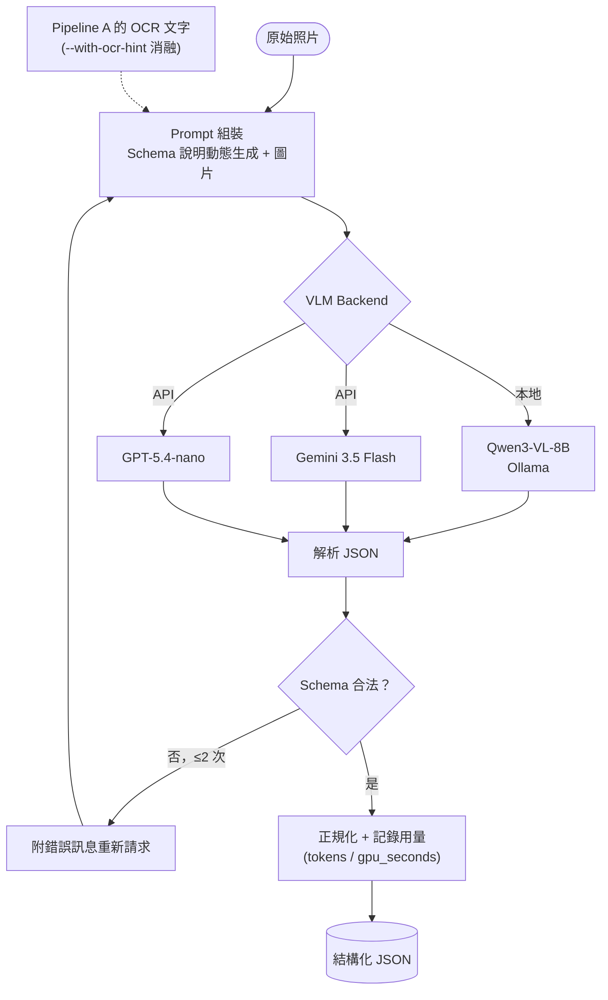
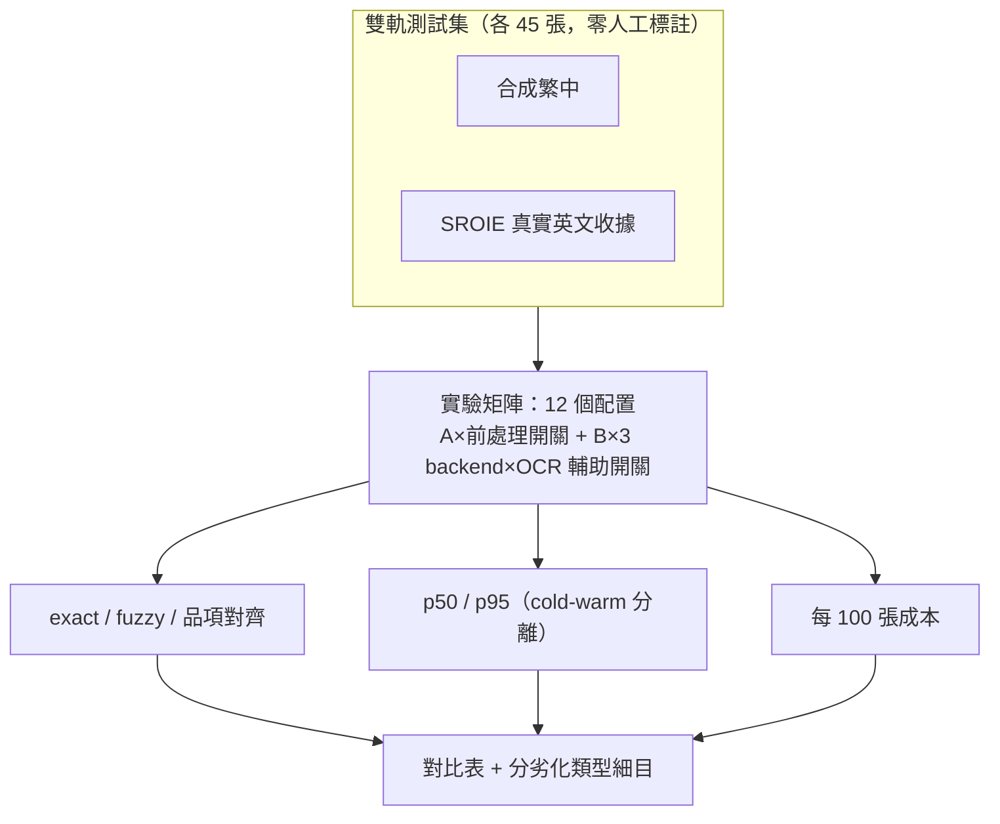
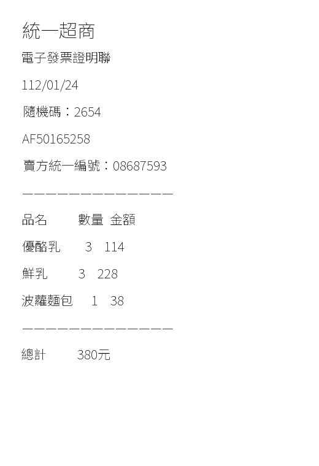
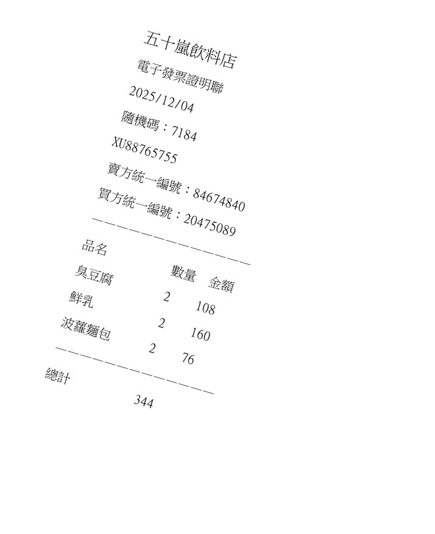
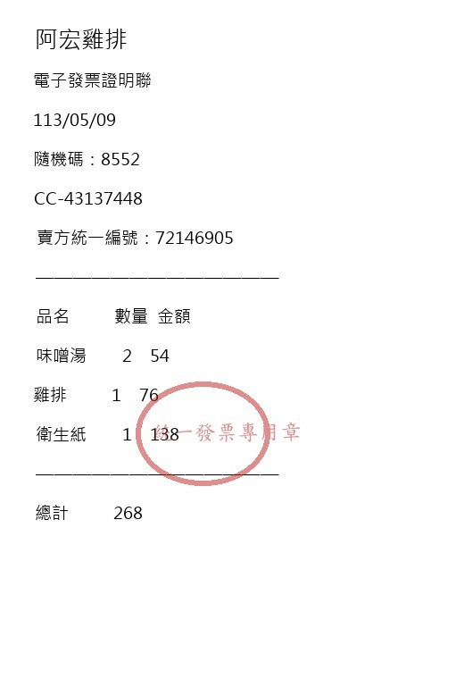
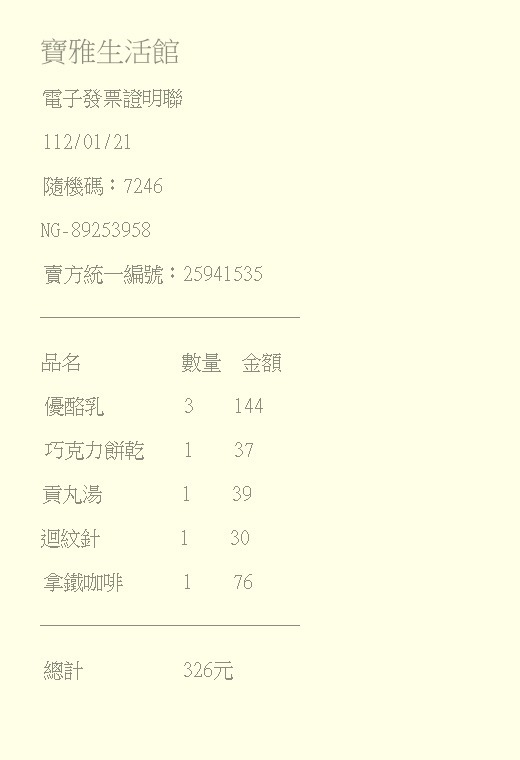
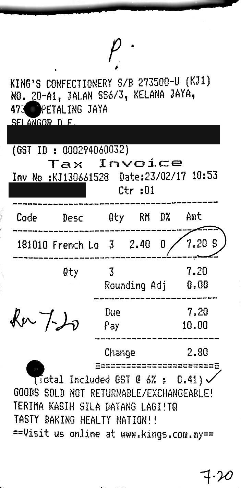
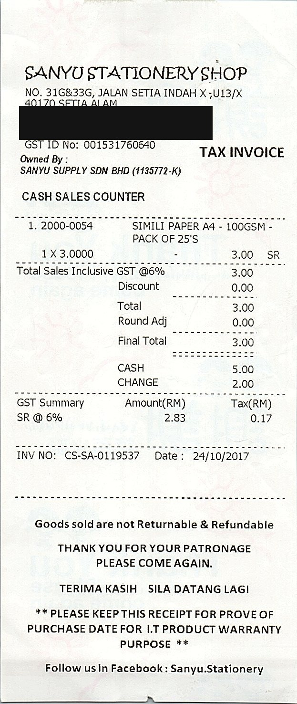

# 繁體中文文件理解：傳統 OCR 管線 vs 端到端 VLM

> 對台灣發票/收據做關鍵欄位抽取（結構化 JSON 輸出），以準確率、延遲、成本三維度，
> 對比「OpenCV 前處理 + PaddleOCR + 規則/LLM 組裝」與「端到端 VLM」兩條管線，
> 並用消融實驗回答「什麼場景該用哪條管線」。

> 正式結果仍採**雙軌方案**——45 張合成繁體中文發票/收據 + 45 張 **SROIE**
>（ICDAR 2019 真實英文收據基準）。另新增 5 張 Wikimedia Commons 真實臺灣繁中收據的
> 小型人工 gold add-on，用來補測手寫、印章、熱感紙與 QR／條碼場景；來源影像採
> metadata-only、checksum-verified 下載，不直接提交進 repository。詳見
> [EVAL_REPORT.md](EVAL_REPORT.md) 與 [optional runbook](docs/OPTIONAL_COMPLETION_RUNBOOK.md)。

> 授權範圍：根目錄的 MIT License 僅適用於本專案原創程式碼；SROIE 資料與衍生範例圖片沿用
> 上游條款。來源、授權標示、修改內容與論文引用見 [THIRD_PARTY_NOTICES.md](THIRD_PARTY_NOTICES.md)。

本 repository 現在有兩條**互相獨立**的研究軌：

1. 原有 receipt benchmark：本頁下方的傳統 OCR vs 端到端 VLM 收據欄位抽取實驗。
2. 新增 complex-document track：5 份繁中公開文件、26 個精選難頁、37 個人工 hard cases，
   量測 parsing error 如何傳到 chunking、retrieval 與答案。它不是 ChatPDF，也沒有改 repository 名稱。
   v0.3 的 hybrid table-region router 將 answer/citation 提高到 0.917，但 MRR 尚未回到 baseline；
   v0.5 的 Qwen parser 與 caption-and-index 也完成正式 GPU 評測但未通過 promotion gates。
   v0.6 再加入 PaddleOCR 正式 row、15 題外部 QA holdout 與 late-max MRR recovery：
   ranker 可進 Hybrid 研究分支，但完整 Hybrid promotion 仍未通過 citation gate。
   v0.7 完成外部 Qwen、3 張圖／4 題 caption gold 與 native-signal targeted VLM：
   targeted + fixed 在外部診斷四項指標都改善，但因這個 fixed factor 是看過 structure MRR
   下滑後才補的 post-hoc analysis，只能列為 promising、必須用新 holdout 重驗。
   v0.8 已在任何新 parser prediction 前凍結第二組 promotion holdout：2 份全新官方年報、
   14 頁、26 題，以及 `PyMuPDF + fixed` 對 `targeted VLM + fixed` 的固定 gate。CPU baseline
   為 Recall@5 0.769、MRR 0.665、answer/citation 0.731；targeted candidate 的 Recall、answer、
   citation 持平，但 MRR 降到 0.626，因此依事前 gate 判定 NO-GO。另以 5 個新圖表／資訊圖
   crop、7 題評估 caption-and-index：generic caption 可把 Recall/answer/citation 提到 0.857，
   但 structured caption 沒有改善 retrieval，original-crop 的 crop Recall 也只有 0.857，
   caption promotion 同樣為 NO-GO。
   v0.9 再加入 3 份全新 OGDL 官方文件、24 個 layout-stratified pages 與 39 題人工 QA 的
   scale-validation。這批 gold 曾參考 source PDF text layer，因此只量測規模穩定性，
   不能覆蓋 v0.8 untouched promotion 結論。Targeted VLM 的 Recall/MRR/answer/citation
   全部改善，屬支持性證據；8 個圖表／9 題的 structured caption 卻沒有改善 retrieval，
   original-crop answer/citation 只有 0.667，因此 caption 仍不支持。
   因此全域替換、正式 structure routing、VLM parser 與 caption promotion 都維持 NO-GO；設計與限制見
   [docs/COMPLEX_DOCUMENT_BENCHMARK.md](docs/COMPLEX_DOCUMENT_BENCHMARK.md)。

## 結果摘要

**核心發現：可移植性崩跌**——Pipeline A 從合成繁中的 0.92~0.97 掉到 SROIE 真實英文收據只剩
0.39~0.42；VLM 只從 0.97~0.98 掉到 0.80~0.86。同一套規則換一個語言/國家的收據就大幅崩潰，
VLM 用同一個 prompt 幾乎原封不動還能用七、八成。

| 管線 | 合成繁中 45 avg exact | SROIE 45 avg exact | p50 延遲（warm，合成/SROIE） | 每 100 張成本 |
|---|---|---|---|---|
| Pipeline A－有前處理 | 0.917 | **0.390** | 19.7s / 19.9s | 近似免費 |
| Pipeline A－無前處理 | 0.965 | **0.416** | 5.6s / 19.3s | 近似免費 |
| Qwen3-VL-8B（本地） | 0.971 | 0.829 | 23.3s / 55.2s | GPU 時間換算 |
| Qwen3-VL-8B + OCR 輔助 | 0.981 | 0.803 | 26.5s / 52.7s | GPU 時間換算 |
| GPT-5.4-nano | 0.660 | 0.857 | 1.8s / 3.6s | $0.04 / $0.10 |
| GPT-5.4-nano + OCR 輔助 | 0.908 | 0.857 | 2.0s / 3.6s | $0.04 / $0.11 |

表中正式數字可直接在 [`results/official/`](results/official/README.md) 查核；公開 artifact 僅含
聚合指標與來源摘要雜湊，不包含逐張 OCR 文字、圖片、執行期錯誤或本機路徑。

其他發現（完整分析見 [EVAL_REPORT.md](EVAL_REPORT.md)）：前處理效果依劣化類型而定，二值化在模糊圖上
讓 Pipeline A 近乎全滅（1.00→0.14）但在旋轉圖上是決定性的（0.76→1.00）；OCR 輔助文字對不同 VLM
效果不一致；items F1 會掩蓋名稱層級的錯字，需搭配 `items_name_exact_rate` 檢查。

## 架構

### Pipeline A：傳統 OCR 管線


### Pipeline B：端到端 VLM



### 評估框架



## 資料範例

<table>
<tr>
<td align="center"><br>合成繁中・清晰基準</td>
<td align="center"><br>合成繁中・旋轉</td>
<td align="center"><br>合成繁中・印章遮擋</td>
<td align="center"><br>合成繁中・熱感紙褪色</td>
<td align="center"><br>SROIE 真實收據（已遮罩）</td>
<td align="center"><br>SROIE 真實收據（已遮罩）</td>
</tr>
</table>

合成繁中圖片為程式生成的虛構內容，無真實個資；上方兩張 SROIE 範例來自真實照片，已遮罩個人
層級資訊（電話、員工代碼），保留店名/GST ID 等商家層級公開資訊（後者正是「Pipeline A 誤把
GST ID 當統編」發現的示範素材）。詳見 [docs/examples/README.md](docs/examples/README.md) 的遮罩政策說明。

## Quickstart

```powershell
# 環境
python -m venv .venv
.venv\Scripts\python -m pip install -r requirements.txt
.venv\Scripts\python -m pytest

# .env（Pipeline B 的 API backend 需要）
copy .env.example .env
# 編輯 .env 填入 GOOGLE_API_KEY / OPENAI_API_KEY

# 產生/下載雙軌資料集（各 45 張，零人工標註）
.venv\Scripts\python scripts\make_synthetic_dataset.py
.venv\Scripts\python scripts\download_sroie.py

# 下載並驗證 5 張公開真實繁中收據（人工 gold 已版本化，原圖留在 ignored data/raw）
.venv\Scripts\python scripts\download_public_receipts.py
.venv\Scripts\python scripts\verify_real_receipt_dataset.py --manifest data\public_receipts_manifest.json --raw-dir data\raw --labels-dir data\public_receipt_labels

# 跑評估框架
.venv\Scripts\python scripts\run_eval.py --images-dir data/synthetic/raw --labels-dir data/synthetic/labels --backends ollama,openai
.venv\Scripts\python scripts\run_eval.py --images-dir data/sroie/raw --labels-dir data/sroie/labels --ocr-lang en --no-items --backends ollama,openai
.venv\Scripts\python scripts\make_report.py results/eval_<timestamp>/summary.json
.venv\Scripts\python scripts\challenge_breakdown.py results/eval_<timestamp>/raw.json data/synthetic/manifest.json

# 不呼叫模型或網路：確認公開 summary 與本機正式結果一致
.venv\Scripts\python scripts\export_official_results.py --check

# 單張圖快速試跑（示範/除錯用，不需要 ground truth）
.venv\Scripts\python scripts\run_pipeline.py --pipeline a --image data/synthetic/raw/syn_001.jpg
.venv\Scripts\python scripts\run_pipeline.py --pipeline b --image data/synthetic/raw/syn_001.jpg --backend qwen3-vl

# 標註工具仍保留（若之後想補真實照片，把照片放進 data/raw/）
.venv\Scripts\python -m uvicorn annotator.main:app --port 8010
```

### Complex-document track

```powershell
# 本機 parser extra；LlamaParse 不在預設安裝內
.venv\Scripts\python -m pip install -e ".[complex-document,test]"

# 只下載 manifest 指定且 checksum 固定的公開 PDF；原始檔受 .gitignore 保護
.venv\Scripts\python scripts\download_complex_documents.py

# 一頁 integration smoke；加 --paddle 才跑較慢的 CPU PaddleOCR
.venv\Scripts\python scripts\smoke_test_complex_document.py

# 從 raw PDF 產生 parser-native output、Spatial IR 與 factor table
.venv\Scripts\python scripts\run_complex_benchmark.py
.venv\Scripts\python scripts\verify_complex_results.py

# v0.4 外部 blind router holdout；沿用同一下載器，但資料與 artifacts 完全分開
.venv\Scripts\python scripts\download_complex_documents.py --manifest data/complex_document/holdout/manifest.json --output-dir data/complex_document/holdout/raw
.venv\Scripts\python scripts\run_table_router_holdout.py
.venv\Scripts\python scripts\verify_table_router_holdout.py

# v0.6/v0.7 外部 15 題 end-to-end QA holdout
.venv\Scripts\python scripts\run_external_qa_holdout.py
# GPU 空閒且 qwen3-vl:8b 已安裝時，加入 full + targeted VLM
.venv\Scripts\python scripts\run_external_qa_holdout.py --reuse-ir --include-qwen
.venv\Scripts\python scripts\verify_external_qa_holdout.py

# v0.8 全新 promotion holdout；先跑 CPU baseline，再於 GPU 空閒時跑 frozen candidate
.venv\Scripts\python scripts\download_complex_documents.py --manifest data/complex_document/promotion_holdout/manifest.json --output-dir data/complex_document/promotion_holdout/raw
.venv\Scripts\python scripts\run_promotion_holdout.py
.venv\Scripts\python scripts\run_promotion_holdout.py --reuse-ir --include-candidate
.venv\Scripts\python scripts\verify_promotion_holdout.py

# v0.8 新增 5 個圖表／資訊圖 crop、7 題；caption 只供檢索，回答仍須讀原始 crop
.venv\Scripts\python scripts\generate_chart_captions.py --manifest data/complex_document/promotion_holdout/manifest.json --targets data/complex_document/promotion_holdout/chart_targets.json --questions data/complex_document/promotion_holdout/questions.json --raw-dir data/complex_document/promotion_holdout/raw --artifact-root artifacts/complex_document/promotion_holdout --output artifacts/complex_document/promotion_holdout/chart_captions/qwen3-vl.json
.venv\Scripts\python scripts\run_promotion_caption_eval.py
.venv\Scripts\python scripts\verify_promotion_caption_eval.py

# 保留 atomic table 的 late-max MRR recovery
.venv\Scripts\python scripts\run_mrr_recovery.py
.venv\Scripts\python scripts\verify_mrr_recovery.py

# 重現同一案例的原始缺失與 table reconstruction partial recovery
.venv\Scripts\python scripts\visualize_parsing_failure.py
.venv\Scripts\python scripts\visualize_parsing_failure.py --parser liteparse-table --output artifacts/complex_document/failures/arc-05-liteparse-table.png

# qwen3-vl:8b 已安裝時才執行；完整 run 為 3 張圖／4 題，
# caption 只索引，回答仍取原始 crop
.venv\Scripts\python scripts\generate_chart_captions.py
.venv\Scripts\python scripts\generate_chart_captions.py --smoke
```

LlamaParse 是隔離的 optional extra：`.venv\Scripts\python -m pip install -e ".[llamaparse]"`。
沒有 `LLAMA_CLOUD_API_KEY` 時 adapter 會明確 skip，不會讓測試或本地可重現路徑失敗。
真正的商業 comparator 另有 `--allow-cloud` 雙重保護，操作與 key 清除方式見
[docs/OPTIONAL_COMPLETION_RUNBOOK.md](docs/OPTIONAL_COMPLETION_RUNBOOK.md)。

Qwen parser / caption 呼叫固定 `think=false`、temperature 0 與 JSON Schema output，避免文件轉錄
浪費 thinking tokens。每頁及每次 caption 呼叫前也會檢查 Ollama：若其他模型正在 GPU 執行，
本次工作會顯示 `SKIP` / `PAUSE`，不會載入、卸載或停止對方模型。

只要查核不會呼叫模型或 API 的單元測試時，可改安裝 `requirements-test.txt`；GitHub Actions
也使用這組輕量依賴，不會在 CI 下載 PaddleOCR 權重或執行任何模型。

本地 Pipeline B backend 需要 [Ollama](https://ollama.com) 並 `ollama pull qwen3-vl:8b`（約 6GB）；
Pipeline A 的 OCR 引擎（PaddleOCR）與品項補漏 LLM（`ollama pull qwen3:4b`）皆在本機 CPU/GPU 執行。

`run_eval.py` 支援 `--only <config>`（如 `a_pre`/`ollama`/`ollama_hint`/`openai_hint`）只跑單一配置、
執行完立刻合併落盤——長時間評估可拆成多個獨立行程跑，中途任何一個掛掉也不會丟失已完成的部分
（正式雙軌評估中，本地 VLM 曾在處理大張真實照片時讓 Ollama 服務崩潰，靠這個設計加上重跑救回來）。

## 文件索引

- [plan.md](plan.md) — 開發計畫、各 Phase 進度與實測發現（含所有踩過的坑）
- [DESIGN.md](DESIGN.md) — 前處理/模型選型理由、結構化輸出穩定性處理
- [EVAL_REPORT.md](EVAL_REPORT.md) — 完整對比表、錯誤類型分析、場景結論
- [docs/DATA_COLLECTION_GUIDE.md](docs/DATA_COLLECTION_GUIDE.md) — 拍攝指引與 diversity matrix
- [docs/OPTIONAL_COMPLETION_RUNBOOK.md](docs/OPTIONAL_COMPLETION_RUNBOOK.md) — 公開真實繁中收據重建方式與已暫緩的 LlamaParse 參考流程
- [results/official/README.md](results/official/README.md) — 去識別化正式評估摘要與重建方式
- [docs/COMPLEX_DOCUMENT_BENCHMARK.md](docs/COMPLEX_DOCUMENT_BENCHMARK.md) — 複雜文件 IR、人工 gold、normalization audit、parser/chunk/RAG 評估與凍結門檻
- [results/complex_document/README.md](results/complex_document/README.md) — factor-at-a-time、外部 holdouts v0.4/v0.6/v0.7 與 artifact 重建方式
- [THIRD_PARTY_NOTICES.md](THIRD_PARTY_NOTICES.md) — SROIE 來源、授權標示、修改與引用

## 目前狀態

- [x] Phase 0：schema 凍結、正規化規則 + 單元測試
- [x] Phase 1：標註工具（含 OCR 預填）+ 拍攝指引（保留備用，未實際採用真人拍照）
- [x] Phase 2：Pipeline A（前處理 + PaddleOCR + layout + 規則/LLM 組裝）
- [x] Phase 3：Pipeline B（本地 qwen3-vl:8b / Gemini 3.5 Flash / gpt-5.4-nano 三個 backend 皆驗證）
- [x] Phase 4：評估框架 + 雙軌 45×2 張正式評估（合成繁中 + SROIE 真實英文收據）已完成
- [x] Phase 5：全部公開文件（本頁、DESIGN、EVAL_REPORT）已用正式雙軌結果撰寫完成
- [x] Public real-receipt add-on：5 張真實臺灣繁中影像、逐張授權／checksum／隱私紀錄與人工 gold；影像可重建但不提交
- [x] Complex-document v0.3：共同 Spatial IR、table-region router、37 個 parser cases、26 個 routing labels 與固定變因 RAG
- [x] Complex-document v0.4：2 份外部官方文件、12 個先標後測 blind routing labels；固定門檻 precision/recall 1.000
- [x] Complex-document v0.5：Qwen3-VL 26 頁 parser 與 caption factor 4/5 完成；兩者依人工 gold 均為 NO-GO
- [x] Complex-document v0.6 CPU stage：PaddleOCR 26 頁正式 row、15 題外部 QA 與 late-max MRR recovery 完成
- [x] Complex-document v0.7 GPU stage：外部 full/targeted Qwen、3 張圖 4 題 caption 與 post-hoc fixed diagnostic 完成；正式 promotion 仍為 NO-GO
- [x] Complex-document v0.8 CPU prep：2 份全新文件、14 頁、26 題與 promotion protocol 已在 prediction 前凍結；CPU baseline 完成
- [x] Complex-document v0.8 GPU stage：frozen targeted-VLM + fixed 與 5 個新 caption crops 已完成；兩項均依事前 gate 自動判定 NO-GO
- [x] Complex-document v0.9 scale-validation：3 份文件、24 頁、39 題 targeted-VLM 與 8 個 caption crops 完成；parser 有支持性改善、caption 不支持，兩者均非 promotion evidence
